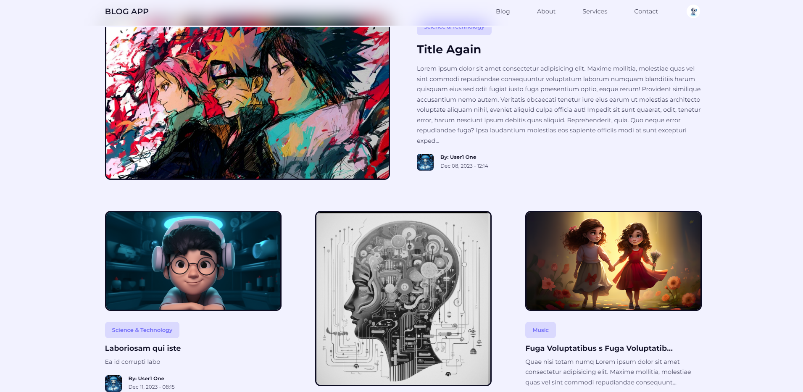

# PHP - BLOG
This is a simple blog application built using PHP and MySQL. It allows users to create, edit, and delete blog posts. The application is designed to be easy to use and can serve as a foundation for further development and customization.

# Getting Started
Follow these steps to get the project up and running on your local machine:

1. Clone the repository
   git clone https://github.com/JimOdera/php-blog
2. Navigate to the project directory
   cd php-blog
3. Database set up, MYSQL
   CREATE DATABASE blog_db;
4. Open the `index.html` file.

 # Usage
1. Create an account.
2. then you are good to go, start posting, editing and deleting.

# Technologies Used
* HTML, CSS (with Tailwind CSS for styling)
* PHP
* JavaScript
  
# Contributing

Contributions are welcome! If you'd like to contribute to the project, please follow these guidelines:

1. Fork the repository.
2. Create a new branch for your feature or bug fix.
3. Make your changes and commit them.
4. Push your changes to your fork.
5. Submit a pull request to the main repository.

# License
This project is licensed under the MIT License - see the LICENSE file for details.

# Contact

If you have any questions or suggestions, please feel free to contact me:

James Odera - james.nyangoma4@gmail.com
